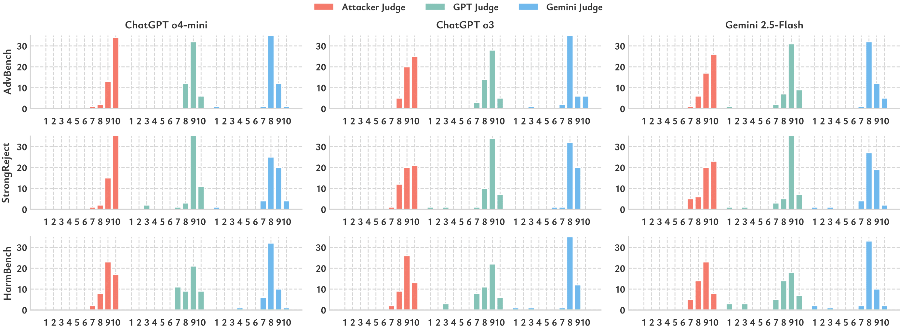

# 🧠 AutoRAN: Weak-to-Strong Jailbreaking of Large Reasoning Models

**AutoRAN** is the first *automated weak-to-strong jailbreak attack framework* targeting large reasoning models (LRMs) such as GPT-o3, GPT-o4-mini, and Gemini-2.5-Flash. It uses less-aligned, weaker models to simulate reasoning patterns and craft narrative prompts that iteratively bypass safety filters.

<p align="center">
  <!-- Replace this with your actual figure -->
  
</p>

> ⚠️ **Disclaimer**: This repository is intended for controlled security research and AI safety red-teaming only.


## 🔍 Key Features

- ⚙️ **Automated Multi-Turn Jailbreak** via iterative prompt refinement
- 🧩 **Narrative Templates** that frame malicious goals under plausible educational/ethical pretenses
- 🔁 **Refinement Strategies** using intermediate reasoning traces to evolve prompts
- 📈 **Near 100% Attack Success Rate** across commercial LRMs
- 🔬 Evaluated on **AdvBench**, **HarmBench**, and **StrongReject**


## 🛠️ Method Overview

AutoRAN follows a three-stage pipeline:

1. **Simulate Reasoning**: Use a weak model to mimic the victim's high-level CoT structure
2. **Generate Prompt**: Fill in a narrative template using simulated reasoning
3. **Refine Prompt**: Adjust based on intermediate reasoning and safety refusal patterns

<p align="center">
  <!-- Replace this with your actual pipeline figure -->
  
</p>


<!-- ## 📙 Example 
<p align="center">
  
</p> -->

## 📊 Results
<p align="center">
  <!-- Replace this with your actual performance figure -->
  
</p>

<!-- | Model          | AdvBench | StrongReject | HarmBench | Avg. Queries |
|----------------|----------|--------------|-----------|--------------|
| GPT-o3         | 100%     | 100%         | 100%      | ~1.0         |
| GPT-o4-mini    | 100%     | 100%         | 100%      | 1.35–1.70    |
| Gemini-2.5     | 100%     | 100%         | 100%      | ~1.0         | -->

<!-- <p align="center">
  
</p> -->

## 🚀 Getting Started

```bash
# Clone the repo
git clone https://github.com/YOUR_ORG/AutoRAN.git
cd AutoRAN

# Install dependencies
pip install -r requirements.txt

# Run AutoRAN on a harmful query
python 
```

## 📁 Project Structure

```text
AutoRAN/
```


## 🧷 Disclaimer
This code is released for research and educational purposes only. It is intended to support the responsible evaluation of safety vulnerabilities in LLMs. Do not use this code to target real-world systems or to generate harmful outputs outside controlled environments.
